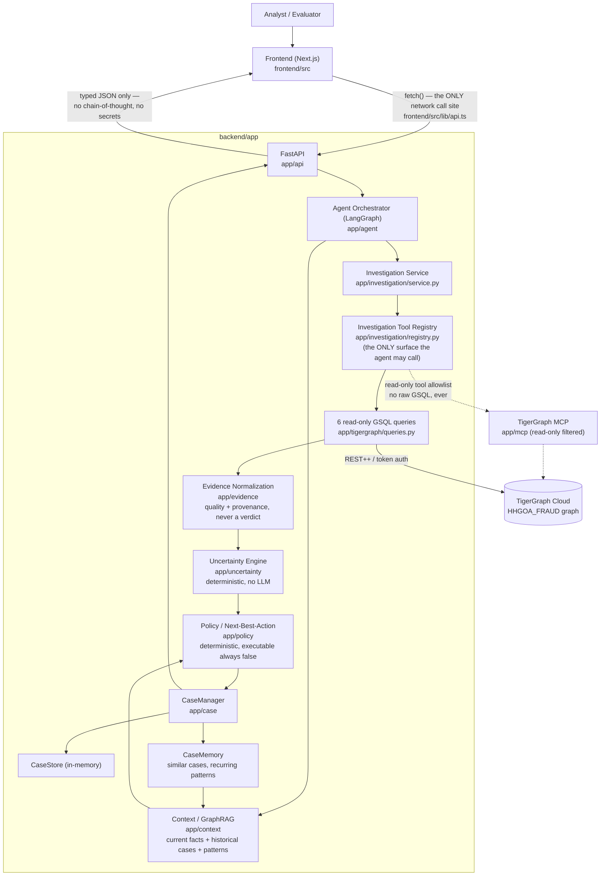

# HHGoa '26 — Agentic Fraud Investigation Agent (powered by TigerGraph)

A graph-native fraud investigation system where TigerGraph and a stack of
deterministic services do the data analysis, and an LLM agent
orchestrates, iterates, and explains — **never the other way around**.
No component in this codebase, deterministic or LLM-orchestrated,
produces a fraud verdict, a fraud probability, or a final score. That is
explicitly out of scope for everything built here.

Status: **backend, agent, API, and frontend are all complete and
integrated** (Phases 0–2L). Phase 2M (this document) is the final
submission-readiness pass — see [Status](#status) for exact, currently
observed test numbers, and [Known limitations](#known-limitations--data-status)
for what remains genuinely unavailable (the official benchmark dataset)
versus what is fully built and tested (everything else).

## Architecture



Every arrow above is a real import/call boundary, not an aspiration —
enforced by AST-level architectural-boundary tests (see
`backend/README.md`'s Testing section) that fail the suite if, say,
`app/agent` ever imported `app.tigergraph.queries` directly, or if a
deterministic engine ever imported an LLM SDK. The frontend has exactly
one network call site (`frontend/src/lib/api.ts`) and never talks to
TigerGraph, GSQL, or MCP directly.

**Design principle:** every deterministic number an investigation
produces — evidence coverage, signal quality, overall uncertainty,
policy authorization, case-similarity score — is computed once, by an
independently unit- and live-tested component. The LLM agent never
recalculates any of them; it decides *when* to call them, interprets
their output, and produces a grounded, evidence-cited explanation.

## Repository layout

```
backend/     Python backend - TigerGraph, evidence, uncertainty, policy,
             case management, GraphRAG/context, the LangGraph agent, the
             FastAPI serving layer, and the benchmark-discovery module.
             See backend/README.md and backend/docs/ for full detail.
frontend/    Next.js investigation console. See backend/docs/phase-2-frontend.md.
```

## Status

Every number below is from an actual command run in this repository —
see [Testing](#testing-this-repository) to reproduce them.

| Layer | Offline tests | Live tests | Notes |
| --- | --- | --- | --- |
| Backend (unit + API) | **329/329 PASS** | — | `pytest tests/unit tests/api` |
| Backend (live, TigerGraph) | — | **currently BLOCKED** | External TigerGraph Cloud outage — see [Live TigerGraph status](#live-tigergraph-status) |
| Frontend (unit + integration) | **30/30 PASS** | — | `npm test` in `frontend/` |
| Frontend (typecheck / lint / build) | **all clean** | — | `tsc --noEmit`, `eslint`, `next build` |

The backend's live suite (79 tests across TigerGraph-backed investigation,
context, case, policy, uncertainty, agent, benchmark, and API layers) is
**fully built and has passed 79/79 in this same development session**
(recorded in `backend/docs/phase-2-api.md` and
`backend/docs/phase-2-benchmark-report.md`) — it is currently unable to
run only because the shared TigerGraph Cloud workspace's token-minting
endpoint is returning `HTTP 500` (external infrastructure, not this
repository — see below). Every live test skips cleanly (not falsely) when
this happens, by design.

### Live TigerGraph status

As of this document's last update, `python backend/scripts/test_tigergraph.py`
reports:

```
✓ Host configured
✓ Graph name configured
✓ Credential configured - using secret
✗ Authentication successful [SERVER] - Could not mint a REST++ token
  from TG_SECRET: HTTPError: 500 Server Error: Internal Server Error
  for url: https://<workspace>.tgcloud.io:443/gsql/v1/tokens
```

This is TigerGraph Cloud's own token-minting endpoint returning a
server-side error — confirmed reproducible across multiple independent
retries and unrelated to general internet connectivity (which was
independently verified reachable). No code in this repository was
changed to "work around" this; live tests skip cleanly rather than
falsely fail (see `backend/README.md`'s "Known environmental behavior").
A prior, independently-observed healthy run of the exact same flow (see
[Demo](#demo)) is fully recorded with real, non-hardcoded values.

## Setup

### Backend

```bash
cd backend
py -3.11 -m venv .venv && .venv/Scripts/python -m pip install -e ".[dev]"
cp .env.example .env        # fill in real values — never commit this file
python scripts/test_tigergraph.py    # verify TigerGraph connectivity
uvicorn app.api.app:create_app --factory --reload   # serves on :8000
```

Required environment variables (`.env`, see `backend/.env.example` for
the full annotated list — never commit real values):

| Variable | Purpose |
| --- | --- |
| `TG_HOST`, `TG_GRAPHNAME` | TigerGraph Savanna endpoint + graph name |
| `TG_SECRET` (or `TG_API_TOKEN`/`TG_JWT_TOKEN`/`TG_PASSWORD`) | TigerGraph credential — token > JWT > secret > password preference |
| `OPENAI_API_KEY`, `OPENAI_MODEL` | Optional — the entire deterministic backend and its test suite run with **no LLM credential at all**, via `FakeLLMClient` |
| `TG_MCP_PROFILE`, `TG_MCP_TRANSPORT` | MCP connection profile (read-only tool subset — see `backend/README.md`'s "TigerGraph MCP" section) |

### Frontend

```bash
cd frontend
npm install
cp .env.example .env.local   # NEXT_PUBLIC_API_URL — points at the backend above
npm run dev                   # serves on :3000
```

The frontend needs exactly one configuration value
(`NEXT_PUBLIC_API_URL`) — it never holds a TigerGraph or LLM credential.

### TigerGraph / MCP

The graph (`HHGOA_FRAUD`) and its schema are provisioned via
`backend/scripts/create_schema.py` and `backend/scripts/load_data.py`
against the (gitignored, not redistributed) development-fallback
dataset — see `backend/data/README.md`. The official `tigergraph-mcp`
server reads the same `TG_*` variables and is restricted to a read-only
tool allowlist (`backend/app/mcp/config.py`) — schema creation and data
loading run through scripts, never through the agent, and the agent
itself never calls MCP directly (its only TigerGraph-facing surface is
`InvestigationService`, reached through the tool registry).

## Demo

Reproducible flow, using the same transaction (`2987937`) throughout
development:

```bash
# terminal 1
cd backend && uvicorn app.api.app:create_app --factory --reload
# terminal 2
cd frontend && npm run dev
# browser
open http://localhost:3000
```

1. The transaction field defaults to `2987937` (editable). Click
   **Investigate**.
2. A generic "AI investigation in progress…" indicator shows while the
   backend runs the full pipeline — it does not claim to show live
   backend stages the API doesn't actually expose (the call is
   synchronous end to end).
3. The result renders: case ID, investigation/case status, uncertainty
   level and its four components (coverage/quality/conflict/
   completeness), the evidence list (type/observation/interpretation/
   quality/status/provenance — low-quality evidence stays visibly
   low-quality, never upgraded), a relationship graph built from that
   same evidence, the next-best-action panel (action/rationale/approval
   requirement/route/executable), historical context (similar cases,
   clearly labeled `SYNTHETIC DEVELOPMENT CASE`), recurring patterns,
   and a case timeline.

**Last independently observed healthy result** (recorded verbatim in
`backend/docs/phase-2-api.md`, not hardcoded anywhere in the
application): `status=COMPLETED`, `uncertainty_level=LOW`,
`action=CREATE_CASE`, `approval_required=true`, `approval_route=ANALYST`,
`executable=false`. **Never presented as fraud confirmation** — see
[Safety / agent boundaries](#safety--agent-boundaries).

**What graceful degradation looks like** (independently, genuinely
observed during this session's TigerGraph outage — see
[Live TigerGraph status](#live-tigergraph-status)): the same transaction
returned `status=COMPLETED` (the pipeline itself did not crash),
`uncertainty_level=UNKNOWN`, `action=REQUEST_MORE_EVIDENCE`,
`approval_required=false`, `approval_route=NONE`, `executable=false`,
with the one evidence item that ran explicitly marked `status=ERROR`
(not silently `EMPTY`) and its `quality="UNKNOWN"` with reason "Query
failed - no observation is available to assess." Five other tools never
ran at all and are listed as `NOT_INVESTIGATED`, distinct from having
run and found nothing. Nothing was fabricated to make the demo look
healthier than the underlying data actually was.

## Safety / agent boundaries

- **Deterministic graph analysis, not LLM analysis.** Every evidence
  item, uncertainty number, and policy recommendation is computed by a
  plain Python engine (`app/evidence`, `app/uncertainty`, `app/policy`),
  never by the LLM. The LLM's only controlled output is one of four
  fixed control-flow actions plus one of four fixed evidence-request
  types (`LLMDecision`, a strict `extra="forbid"` Pydantic schema) — it
  cannot invoke arbitrary code or bypass any engine.
- **Controlled tools only.** The agent's only TigerGraph-facing surface
  is `InvestigationService.investigate_transaction()`, which internally
  runs six explicitly-registered tools through
  `app/investigation/registry.py`. No raw GSQL is ever reachable from
  the LLM, the API, or the frontend — verified by AST-level tests, not
  just convention.
- **No arbitrary GSQL, anywhere.** `TigerGraphClient.gsql()` refuses a
  write statement unless `allow_write=True` is passed explicitly by
  trusted internal code (never by a route handler or the agent); no API
  route accepts a raw query string or GSQL parameter (verified in
  `backend/tests/api/test_security.py` by walking the actual generated
  OpenAPI schema).
- **Approval-gated, never self-executing.** Every `PolicyDecision.executable`
  is `False` for every action this system can currently produce — there
  is no payment processor, case-management system, or customer-messaging
  integration wired up to actually carry an action out. A recommendation
  is a recommendation.
- **Uncertainty is not fraud probability.** `UncertaintyAssessment` has
  no `fraud_probability`/`fraud_confidence` field, and every UI surface
  that shows the number carries an explicit disclaimer. See
  [Data limitation](#known-limitations--data-status) for how this project
  also keeps the *dataset's* fraud label fully isolated from this number.
- **The LLM orchestrates; it does not replace graph analytics.** It
  decides when to call the deterministic pipeline and produces the final
  grounded explanation — it never recomputes evidence, uncertainty, or
  policy.
- **No chain-of-thought exposure.** The agent's internal
  observability/event trail (`AgentMessage`/`agent_messages`) is not
  serialized into any API response at all (grep-verified: zero
  references to `agent_messages` anywhere under `backend/app/api/`) — the
  API and frontend only ever surface the final structured result and a
  grounded, evidence-cited explanation.

## Known limitations / data status

**The official `HHGOA_IEEE` dataset and 20-case benchmark package were
not available anywhere in this development environment** — searched
exhaustively and documented in `backend/docs/phase-1-report.md` §1 and
re-verified in `backend/docs/phase-2-benchmark-report.md`. Per that
finding, this project uses the public **IEEE-CIS Fraud Detection**
Kaggle dataset strictly as a **development fallback**:

- It is labeled `DEVELOPMENT_IEEE_CIS_DATA` everywhere it appears in
  code, docs, and this README — **never presented as the official HHGoa
  benchmark.**
- Its only fraud signal is a binary `isFraud` training label. This
  project **never** uses it as an agent confidence score, a risk score,
  or a policy input anywhere — independently verified, both
  behaviorally and via static (AST) source inspection, in every relevant
  phase's test suite (see `backend/README.md`'s "No fraud verdict,
  anywhere" section).
- **No official 20 benchmark case, expected answer, fraud typology, or
  bank policy threshold is fabricated anywhere in this repository.**
  `backend/app/benchmark/discovery.py` searches for the real official
  material at the paths the challenge would provide it at, and raises
  rather than silently substituting fallback data when it finds none —
  see `backend/docs/phase-2-benchmark-report.md` for the full, honest
  accounting (official cases discovered: 0).
- What *is* real and tested against this fallback: a full, live,
  end-to-end diagnostic run of the entire pipeline (5/5 completed, 0
  failures — `backend/docs/phase-2-benchmark-report.md`), clearly
  labeled `is_official_benchmark: false` in its own output.

Historical/similar-case data shown anywhere in the API or UI is
synthetic development data, always labeled `SYNTHETIC DEVELOPMENT CASE`
when its `is_synthetic` flag is set — never presented as a real prior
bank investigation.

## Security

- No credential is ever hardcoded; all configuration comes from the
  environment. `.env`/`.env.local` are git-ignored everywhere in this
  repo; only `.env.example` (placeholders only, audited this session) is
  trackable.
- The logging layer redacts anything matching a password/secret/token/key
  pattern before it reaches a handler (`backend/app/logging.py`).
- The API's exception handlers never leak a stack trace or raw exception
  message to a client — always a fixed, safe sentence
  (`backend/app/api/app.py`); the real detail is server-side log only.
- The frontend has exactly one network call site
  (`frontend/src/lib/api.ts`) and cannot reach TigerGraph, GSQL, or MCP
  under any code path — verified this session by grepping the entire
  frontend source tree.
- **Known, documented, unresolved issue** (inherited, not introduced by
  this phase): `pyTigerGraph` 2.0.4 unconditionally disables TLS
  certificate verification for any HTTPS host. The connection is
  genuinely encrypted but the certificate chain is never validated — see
  `backend/docs/phase-2-evidence-model.md` §8 for the full root-cause
  writeup and why an inconclusive workaround attempt was not applied.

See `backend/README.md`'s own Security section and
`backend/docs/phase-2-api.md` §10 for the full API-layer security
boundary detail.

## Testing this repository

```bash
# backend — offline (no network, no credentials, no LLM key needed)
cd backend && .venv/Scripts/python -m pytest tests/unit tests/api -v

# backend — live (requires a reachable TigerGraph; skips cleanly otherwise)
cd backend && .venv/Scripts/python -m pytest tests/tigergraph -v -m tigergraph

# frontend
cd frontend && npm test && npx tsc --noEmit && npm run lint && npm run build
```

## Full documentation index

- `backend/README.md` — backend architecture, setup, dataset, MCP, testing, security
- `backend/docs/phase-1-report.md` — dataset + TigerGraph connection, the official-dataset search record
- `backend/docs/phase-2-*.md` — one evidence-backed report per component (evidence model, uncertainty, policy/NBA, case management, tool registry, agent orchestrator, GraphRAG/context, API, benchmark)
- `backend/docs/phase-2-frontend.md` — frontend architecture, API integration, testing, security, known limitations
- `backend/docs/tigergraph-schema.md`, `backend/docs/dataset-analysis.md` — schema and dataset profile, generated from the real data
"# HHGOA_26" 
