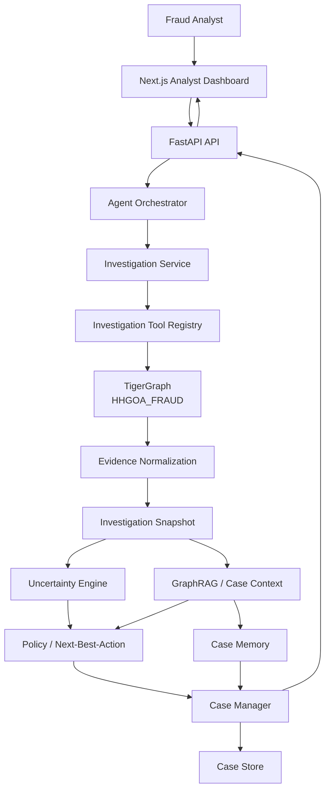
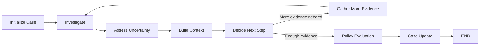
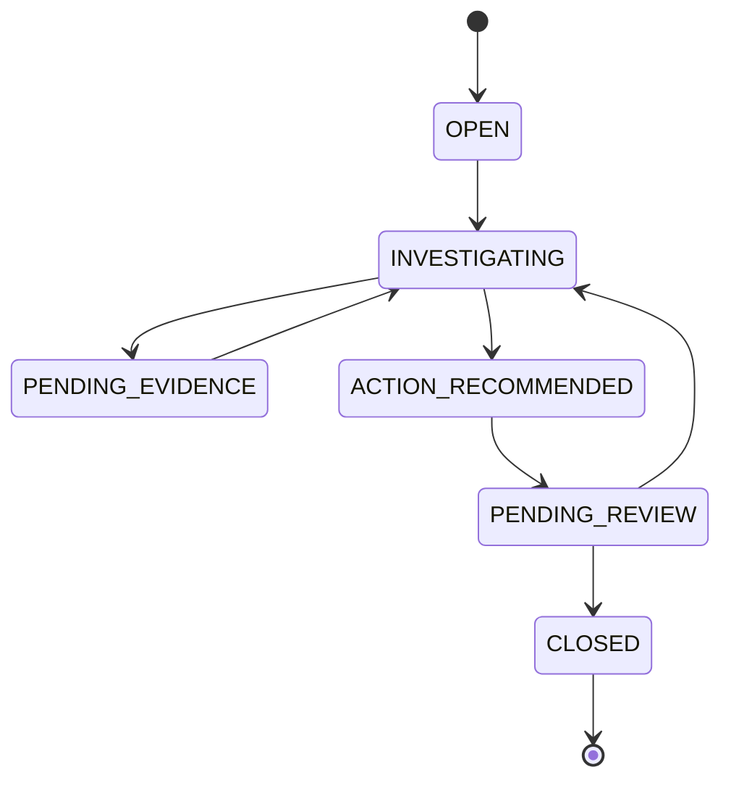

# Agentic Fraud Investigation Agent

**AI-powered fraud investigation using TigerGraph, GraphRAG, controlled tools, and case memory**

*Hacker House Goa '26 — TigerGraph Challenge*

An agentic fraud investigation system that uses TigerGraph as the investigation engine and an AI agent as the orchestration and reasoning layer.

Instead of asking an LLM to guess whether a transaction is fraudulent, the system first gathers structured evidence from a fraud graph, evaluates evidence quality and uncertainty, retrieves relevant historical investigation context, determines a traceable next-best action, and creates a persistent investigation case.

The result is an investigation workflow that is evidence-driven, traceable, uncertainty-aware, and approval-gated.

## Live Deployment

| | URL | Hosting |
| --- | --- | --- |
| **Analyst Dashboard** | https://hhgoa-fraud-frontend.vercel.app | Vercel |
| **Backend API** | https://hhgoa-fraud-backend.onrender.com | Render |
| **API Docs (Swagger)** | https://hhgoa-fraud-backend.onrender.com/docs | Render |
| **Health Check** | https://hhgoa-fraud-backend.onrender.com/health/dependencies | Render |

Open the dashboard, go to **Investigate**, and run the demo transaction `2987937`.

> The backend runs on Render's free tier and sleeps after 15 minutes of inactivity. The first request after that can take about a minute while it wakes up, and in-memory cases are reset on each restart.

## What does this project do?

Given a transaction such as:

```
Transaction ID: 2987937
```

the system can:

- Investigate the transaction through TigerGraph.
- Discover connected entities and transaction relationships.
- Normalize graph results into structured evidence.
- Evaluate evidence coverage, quality, conflicts, and uncertainty.
- Retrieve similar historical cases and recurring patterns.
- Determine a development-policy next-best action.
- Create and update an investigation case.
- Preserve evidence, decisions, actions, and outcomes.
- Present the entire investigation through an analyst dashboard.

### The core idea

**LLM does not replace graph analytics.**

```
TigerGraph  → finds evidence
Agent       → orchestrates investigation
Rules       → evaluate uncertainty & policy
Case Memory → provides historical context
UI          → explains the investigation
```

## Problem

Fraud investigation is rarely a simple binary classification problem.

An analyst may need to answer:

- What is connected to this transaction?
- Has the same card appeared elsewhere?
- Is the device shared?
- Are multiple transactions connected through an address?
- Is there a suspicious network pattern?
- How complete is the available evidence?
- Are the signals contradictory?
- Have similar cases been investigated before?
- What should happen next?
- Does that action require human approval?
- What evidence supports the recommendation?

Traditional ML classification can provide a score, but it does not inherently provide the investigation trail behind the decision.

This project treats fraud investigation as a structured, tool-driven workflow rather than a single prediction.

## Core Architecture



## Investigation Workflow

The complete workflow is:

```
Transaction
     │
     ▼
Initialize Investigation
     │
     ▼
Investigate through controlled tools
     │
     ├── Transaction Context
     ├── Shared Card Activity
     ├── Shared Address Activity
     ├── Shared Device Activity
     ├── Shared Email Activity
     └── Transaction Network
     │
     ▼
Normalize Evidence
     │
     ▼
Assess Uncertainty
     │
     ▼
Build Historical Context
     │
     ├── Similar Cases
     ├── Recurring Patterns
     └── Missing Information
     │
     ▼
Determine Next-Best Action
     │
     ▼
Create / Update Case
     │
     ▼
Present Investigation to Analyst
```

The agent can iterate when more evidence is required, subject to bounded investigation limits.

## TigerGraph Investigation Layer

TigerGraph is the core investigation engine.

The graph currently contains:

**Vertex types:** `Transaction`, `Card`, `Address`, `EmailDomain`, `Device`

**Edge types:** `MADE_WITH_CARD` (Transaction→Card), `BILLED_TO` (Transaction→Address), `PURCHASER_EMAIL` / `RECIPIENT_EMAIL` (Transaction→EmailDomain), `USED_DEVICE` (Transaction→Device)

The graph connects transactions with their associated entities and relationships, allowing the investigation service to traverse transaction networks instead of treating each transaction as an isolated row.

The current development graph contains approximately:

- **6,676 vertices**
- **15,627 edges**

The exact graph contents are generated from the available development dataset — see [Development dataset & benchmark limitation](#development-dataset--benchmark-limitation).

## Investigation Tools

The application exposes a controlled investigation tool registry.

Current read-only investigation capabilities include:

| Tool | Purpose |
| --- | --- |
| `get_transaction_context` | Retrieve the primary transaction context |
| `find_shared_card_activity` | Find activity connected through a card |
| `find_shared_address_activity` | Find activity connected through an address |
| `find_shared_device_activity` | Find activity connected through a device |
| `find_shared_email_activity` | Find activity connected through an email domain |
| `investigate_transaction_network` | Investigate the broader transaction network |

The agent does not receive unrestricted GSQL execution.

Instead:

```
Agent
  ↓
Investigation Service
  ↓
Tool Registry
  ↓
Approved Read-Only Tool
  ↓
TigerGraph
```

This keeps the agent's access bounded and auditable.

## Evidence Model

Raw graph results are not passed directly around the application.

They are normalized into structured evidence.

Each evidence item contains information such as:

- Evidence Type
- Observation
- Interpretation
- Provenance
- Quality
- Status
- Evidence ID
- Metrics
- Related Entities

Example conceptual structure:

```json
{
  "type": "shared_card",
  "status": "SUCCESS",
  "observation": "...",
  "interpretation": "...",
  "quality": "MEDIUM",
  "provenance": {
    "source": "tigergraph",
    "entity_id": "..."
  }
}
```

The system deliberately distinguishes:

- `SUCCESS`
- `EMPTY`
- `ERROR`
- `NOT_INVESTIGATED`

An empty result is not treated as an error.

An unavailable source is not converted into fabricated evidence.

## Evidence Quality

Not every graph relationship is equally informative.

The system preserves evidence quality instead of treating every relationship as equally strong.

For example, address-based relationships in the development dataset may represent relatively coarse regional/address information.

Therefore the system explicitly preserves the lower quality of that evidence rather than presenting it as a definitive fraud signal.

This is important for the investigation layer because:

> More connected data does not automatically mean stronger evidence.

## Uncertainty Engine

The Uncertainty Engine is deterministic and independent of the LLM.

It evaluates the investigation itself rather than producing a fraud probability.

The assessment considers:

- Evidence coverage
- Evidence quality
- Signal conflict
- Data completeness
- Missing evidence
- Conflicting evidence
- Overall investigation uncertainty

Conceptually:

```
Evidence
   │
   ├── Coverage
   ├── Quality
   ├── Conflicts
   └── Completeness
          │
          ▼
   Uncertainty Assessment
          │
          ▼
   LOW / MEDIUM / HIGH / UNKNOWN
```

**Important distinction**

The system does not equate:

> investigation uncertainty

with:

> probability of fraud

They are separate concepts.

## GraphRAG / Historical Context

The agent does not investigate every transaction in isolation.

Before making a decision, the system can construct structured investigation context from case memory.

Context can contain:

**Current Facts** — evidence collected during the current investigation.

**Historical Cases** — previously stored investigation cases with similar characteristics.

**Recurring Patterns** — patterns detected across historical cases.

**Missing Information** — evidence that may still be required.

### Historical similarity

Similar cases are retrieved using deterministic structured similarity.

The current similarity model considers:

| Component | Weight |
| --- | --- |
| Evidence-type overlap | 40% |
| Uncertainty-level match | 20% |
| Action match | 20% |
| Conflict-type overlap | 10% |
| Trigger match | 10% |

Results are deterministic and reproducible.

The historical context is treated as data, not as instructions to the agent.

This prevents historical case content from becoming an uncontrolled prompt-injection mechanism.

## Agent Orchestrator

The agent is implemented using a bounded LangGraph workflow.



The orchestration loop is bounded by:

- maximum iterations
- maximum tool calls
- controlled tool access
- explicit failure handling
- explicit limit handling

The LLM is therefore not given unrestricted control over the system.

### What the LLM does

The LLM is responsible for:

- understanding the investigation state;
- selecting appropriate investigation steps within the available workflow;
- synthesizing structured evidence;
- identifying information gaps;
- using historical context;
- explaining findings;
- supporting the investigation workflow.

The LLM is **not** responsible for:

- executing arbitrary GSQL;
- directly calling TigerGraph;
- bypassing the tool registry;
- executing financial or external actions;
- inventing evidence;
- replacing deterministic graph analytics;
- exposing hidden chain-of-thought.

## Next-Best Action

The system contains a deterministic policy engine for development-time next-best-action decisions.

Available action vocabulary includes:

- `ALLOW_TRANSACTION`
- `BLOCK_TRANSACTION`
- `MONITOR_ACCOUNT`
- `WARN_CUSTOMER`
- `CREATE_CASE`
- `REQUEST_MORE_EVIDENCE`
- `ESCALATE_ANALYST`
- `FILE_REPORT`

Actions may require different approval routes.

For example:

```
Action
  │
  ▼
Policy Engine
  │
  ├── Can system act?
  ├── Is evidence sufficient?
  ├── What is the uncertainty?
  ├── How strong is the evidence?
  └── Are there conflicts?
          │
          ▼
    Policy Decision
          │
          ├── Action
          ├── Approval Route
          ├── Evidence IDs
          └── Executable
```

**Important**

The current policy rules are explicitly:

> PROJECT DEVELOPMENT HEURISTIC — NOT OFFICIAL HHGOA POLICY

The system does not claim that these heuristics represent the official bank policy from the challenge dataset.

Actions that require human approval remain approval-gated.

## Case Management

Every investigation can become a structured case.

A case can contain:

```
Case
 ├── Trigger
 ├── Status
 ├── Findings
 ├── Evidence
 ├── Decisions
 ├── Recommendations
 ├── Actions
 ├── Approval state
 ├── Outcomes
 └── Historical context
```

### Case lifecycle



`CLOSED` is terminal.

## Case Memory

Case Memory supports:

- retrieval by transaction;
- retrieval by evidence pattern;
- retrieval by action;
- retrieval by outcome;
- similar-case retrieval;
- recurring-pattern detection.

This allows the agent to reason with historical investigation context without requiring an external vector database.

The current implementation uses structured deterministic retrieval rather than embeddings.

## Analyst Dashboard

The frontend is built with:

- Next.js 16
- React 19
- TypeScript
- Tailwind CSS v4

The dashboard provides a single investigation console.

```
┌─────────────────────────────────────────────┐
│          FRAUD INVESTIGATION CONSOLE        │
├─────────────────────────────────────────────┤
│ Transaction ID                               │
│ [ 2987937                    ] [Investigate]│
├─────────────────────────────────────────────┤
│ Investigation Summary                       │
│ Case | Status | Uncertainty | Action        │
├─────────────────────────────────────────────┤
│ Next-Best Action                            │
├───────────────────────┬─────────────────────┤
│ Evidence              │ Investigation Graph │
├───────────────────────┼─────────────────────┤
│ Uncertainty           │ Agent Findings      │
├───────────────────────┴─────────────────────┤
│ Historical Context / Recurring Patterns     │
├─────────────────────────────────────────────┤
│ Case Timeline                               │
└─────────────────────────────────────────────┘
```

The graph visualization is generated from actual evidence returned by the backend.

It does not invent graph edges.

## API

The frontend communicates exclusively with the FastAPI backend.

**Health**
- `GET /health`
- `GET /health/dependencies`

**Investigations**
- `POST /investigations`
- `GET /investigations/{investigation_id}`

**Cases**
- `GET /cases`
- `GET /cases/{case_id}`
- `GET /cases/{case_id}/evidence`
- `GET /cases/{case_id}/history`
- `GET /cases/{case_id}/similar`
- `GET /cases/{case_id}/context`

Interactive API documentation is available through FastAPI's generated OpenAPI documentation (`/docs`, `/openapi.json`) when the backend is running.

## Project Structure

```
.
├── backend/
│   ├── app/
│   │   ├── agent/
│   │   │   ├── state.py
│   │   │   ├── llm.py
│   │   │   ├── prompts.py
│   │   │   └── orchestrator.py
│   │   │
│   │   ├── api/
│   │   │   ├── app.py
│   │   │   ├── models.py
│   │   │   ├── dependencies.py
│   │   │   ├── registry.py
│   │   │   └── errors.py
│   │   │
│   │   ├── benchmark/
│   │   │   ├── discovery.py
│   │   │   ├── models.py
│   │   │   └── runner.py
│   │   │
│   │   ├── case/
│   │   │   ├── models.py
│   │   │   ├── store.py
│   │   │   ├── manager.py
│   │   │   └── memory.py
│   │   │
│   │   ├── context/
│   │   │   ├── models.py
│   │   │   ├── builder.py
│   │   │   └── formatter.py
│   │   │
│   │   ├── evidence/
│   │   │   └── ...
│   │   │
│   │   ├── policy/
│   │   │   ├── models.py
│   │   │   └── engine.py
│   │   │
│   │   └── tigergraph/
│   │       └── queries.py
│   │
│   ├── tests/
│   │   ├── unit/
│   │   ├── api/
│   │   └── tigergraph/
│   │
│   ├── docs/
│   │   ├── phase-2-evidence-model.md
│   │   ├── phase-2-tool-registry.md
│   │   ├── phase-2-uncertainty-model.md
│   │   ├── phase-2-policy-nba.md
│   │   ├── phase-2-case-management-memory.md
│   │   ├── phase-2-agent-orchestrator.md
│   │   ├── phase-2-graphrag-context.md
│   │   ├── phase-2-benchmark-report.md
│   │   ├── phase-2-api.md
│   │   ├── phase-2-frontend.md
│   │   └── phase-2m-demo-and-judging-checklist.md
│   │
│   ├── data/
│   │   └── hhgoa/          # not committed - see backend/data/README.md
│   │
│   ├── scripts/
│   └── pyproject.toml
│
├── frontend/
│   ├── src/
│   │   ├── app/
│   │   ├── components/
│   │   └── lib/
│   │       ├── api.ts
│   │       └── types.ts
│   └── ...
│
└── README.md
```

## Getting Started

### Requirements

**Backend**
- Python 3.11 (3.11–3.12)
- TigerGraph / TigerGraph Cloud with a configured graph
- Required environment variables (see `backend/.env.example`)

**Frontend**
- Node.js
- npm

### 1. Clone

```bash
git clone https://github.com/rohan911438/HHGOA_26.git
cd HHGOA_26
```

### 2. Backend setup

```bash
cd backend

# create and activate a Python 3.11 environment
py -3.11 -m venv .venv
# Windows
.venv\Scripts\activate
# Linux / macOS
source .venv/bin/activate

# install dependencies (includes test tooling)
pip install -e ".[dev]"

# create the environment file
cp .env.example .env
```

Configure the required values in `.env` locally (TigerGraph host/graph/credential, optionally an LLM key). **Never commit `.env`.**

### 3. Start the backend

```bash
uvicorn app.api.app:create_app --factory --reload
```

The API is available at `http://localhost:8000`. FastAPI documentation: `http://localhost:8000/docs`.

## Frontend Setup

```bash
cd frontend
npm install
cp .env.example .env.local    # NEXT_PUBLIC_API_URL - point at the backend above
npm run dev
```

Open `http://localhost:3000` in your browser.

## Running Tests

### Backend

```bash
cd backend
pytest tests/unit tests/api
```

The project currently has:

**329 / 329 backend offline tests passing**

Live tests (require a reachable TigerGraph connection, skip cleanly otherwise):

```bash
pytest tests/tigergraph -m tigergraph
```

**79 / 79 backend live tests passing** (last run against the active TigerGraph workspace)

### Frontend

```bash
cd frontend
npm test
```

Current result:

**30 / 30 frontend tests passing**

### TypeScript

```bash
npx tsc --noEmit
```

### Lint

```bash
npm run lint
```

### Production build

```bash
npm run build
```

## Demo

The primary demonstration transaction is:

```
2987937
```

The intended demonstration flow is:

```
1. Open analyst dashboard
        ↓
2. Enter transaction ID
        ↓
3. Start investigation
        ↓
4. Agent gathers graph evidence
        ↓
5. Evidence is normalized
        ↓
6. Uncertainty is evaluated
        ↓
7. Historical context is retrieved
        ↓
8. Next-best action is determined
        ↓
9. Case is created
        ↓
10. Analyst reviews the investigation
```

### Verified healthy result

Freshly re-confirmed live against the TigerGraph workspace (2026-09-22, transaction `2987937`, 6 evidence items gathered — shared card, shared address, shared email domain, shared device, transaction context, and the network-pattern summary):

```
Status:              COMPLETED
Case ID:             case-8eb22537c8ea408294245659aa73743c
Uncertainty:         LOW (overall_uncertainty = 0.178)
Action:              CREATE_CASE
Approval Required:   YES
Approval Route:      ANALYST
Executable:          false
Iterations/Tools:    1 / 1
```

These values are observed system output from a real live run against the live `HHGOA_FRAUD` graph, not hardcoded demo values.

## Security & Agent Boundaries

Security and control are core design principles.

### No frontend access to TigerGraph

```
Frontend
   ↓
FastAPI
   ↓
Application layer
   ↓
TigerGraph
```

The frontend never communicates directly with:

- TigerGraph
- GSQL
- MCP

### No arbitrary GSQL

The agent cannot submit arbitrary GSQL queries.

Only registered investigation tools are exposed through the application boundary.

### Read-only investigation tools

The investigation registry exposes controlled read-only operations.

Destructive graph operations are not available to the agent workflow.

### Approval-gated actions

A policy recommendation does not automatically mean that the action is executed.

The current system explicitly represents:

- `approval_required`
- `approval_route`
- `executable`

The current investigation workflow keeps execution disabled.

### No chain-of-thought exposure

The application exposes investigation findings, evidence, rationale, and traceability information.

It does not expose hidden chain-of-thought.

## Development Dataset & Benchmark Limitation

The official HHGOA_IEEE dataset and official 20-case benchmark package were not available in the development environment during implementation.

Therefore:

**The official benchmark cases and expected answers were not fabricated.**

For development and engineering validation, the project used the publicly available IEEE-CIS Fraud Detection dataset as a development fallback.

This fallback is used for:

- graph development;
- integration testing;
- investigation tooling;
- pipeline validation;
- UI development;
- system testing.

It is **not** represented as the official HHGOA benchmark dataset.

The fallback dataset contains an `isFraud` field. That field is kept separate from:

- investigation uncertainty;
- evidence quality;
- policy decisions;
- agent confidence.

No official HHGOA benchmark score is claimed from the fallback data. Full accounting: `backend/docs/phase-2-benchmark-report.md`.

## Infrastructure Resilience (Previously Encountered Outage, Now Resolved)

During final integration verification, TigerGraph Cloud's REST++ token-minting endpoint (`gsql/v1/tokens`) intermittently returned `HTTP 500`. The issue was independently reproduced multiple times, classified as an external TigerGraph Cloud workspace problem (the workspace had gone idle), and **no application workaround was introduced**.

**Status: resolved.** After the workspace was reactivated, `python backend/scripts/test_tigergraph.py` reports `ALL CHECKS PASSED` (host reachable, authentication via secret, graph `HHGOA_FRAUD` accessible, schema accessible — 5 vertex types / 5 edge types, 6,676 vertices confirmed via a real read-only query), and a fresh live investigation completed end to end (see [Verified healthy result](#verified-healthy-result) above).

What's worth keeping on record is how the system behaved **while** the outage was active — this is real, observed behavior, not a hypothetical:

```
TigerGraph unavailable
        ↓
Evidence source → ERROR
        ↓
Uncertainty → UNKNOWN
        ↓
NBA → REQUEST_MORE_EVIDENCE
        ↓
Executable → false
```

The system distinguishes:

- `SUCCESS`
- `EMPTY`
- `ERROR`
- `NOT_INVESTIGATED`

rather than hiding infrastructure failures — no fabricated evidence, no fabricated verdict, and a case was still created for follow-up. This graceful-degradation path is exercised by this project's live test suite regardless of current TigerGraph availability.

## Validation Status

| Area | Status |
| --- | --- |
| Backend offline tests | 329/329 |
| Frontend tests | 30/30 |
| TypeScript | PASS |
| ESLint | PASS |
| Production build | PASS |
| API architecture | Verified |
| Agent tool boundary | Verified |
| Frontend → TigerGraph isolation | Verified |
| Security audit | PASS |
| Backend live tests (TigerGraph) | 79/79 |
| Live investigation end-to-end | Verified (transaction 2987937, see Demo) |
| Official HHGOA benchmark | Unavailable |

## Design Principles

The system was built around several principles:

**1. Evidence before action** — the agent should investigate before recommending an action.

**2. Graph analytics before LLM reasoning** — TigerGraph provides structured relationship evidence. The LLM synthesizes and orchestrates that evidence.

**3. Uncertainty is explicit** — missing or conflicting evidence should reduce confidence in the investigation rather than being silently ignored.

**4. Tool access is controlled** — the agent receives a bounded set of investigation capabilities.

**5. Human approval matters** — sensitive actions remain approval-gated.

**6. Historical context is data** — past cases inform the investigation but do not become instructions.

**7. Everything should be traceable** — evidence, decisions, recommendations, and cases retain identifiers and provenance.

**8. Graceful degradation** — infrastructure failures should produce explicit uncertainty/error states rather than fabricated conclusions.

## Why a Graph?

Fraud is often relational.

A single transaction may appear normal in isolation but become more interesting when connected to:

```
Transaction
    │
    ├── Card
    │     └── Other transactions
    │
    ├── Device
    │     └── Other transactions
    │
    ├── Email Domain
    │     └── Other transactions
    │
    └── Address
          └── Other transactions
```

Graph databases allow the investigation to traverse these relationships directly.

This makes the graph particularly useful for discovering:

- shared entities;
- connected transactions;
- transaction networks;
- repeated relationships;
- clusters of activity.

## Why Agentic Investigation?

A traditional pipeline might look like:

```
Transaction
    ↓
Model
    ↓
Fraud Score
    ↓
Decision
```

This project instead uses:

```
Transaction
    ↓
Investigate
    ↓
Collect Evidence
    ↓
Assess Uncertainty
    ↓
Retrieve Context
    ↓
Decide Next Step
    ↓
Create Case
    ↓
Human Review
```

The distinction is important.

The system is not simply asking an LLM:

> "Is this transaction fraudulent?"

It is asking:

> "What evidence should be investigated, what does that evidence show, how complete and reliable is it, what historical context is relevant, and what should happen next?"

## Technology Stack

| Layer | Technology |
| --- | --- |
| Graph Database | TigerGraph |
| Graph Querying | GSQL |
| Graph Access | TigerGraph MCP / controlled application tools |
| Agent Orchestration | LangGraph |
| LLM | Google Gemini (OpenAI-compatible endpoint) |
| Backend | FastAPI |
| Language | Python |
| Frontend | Next.js 16 |
| UI | React 19 + Tailwind CSS v4 |
| API Contract | OpenAPI |
| Case Memory | Structured deterministic retrieval |
| Testing | Pytest + Jest |
| Build | Next.js / Turbopack |
| Hosting | Vercel (frontend) + Render (backend) |

## Documentation

Detailed engineering documentation is available under `backend/docs/`:

- `phase-2-evidence-model.md`
- `phase-2-tool-registry.md`
- `phase-2-uncertainty-model.md`
- `phase-2-policy-nba.md`
- `phase-2-case-management-memory.md`
- `phase-2-agent-orchestrator.md`
- `phase-2-graphrag-context.md`
- `phase-2-benchmark-report.md`
- `phase-2-api.md`
- `phase-2-frontend.md`
- `phase-2m-demo-and-judging-checklist.md`

These documents describe the implementation decisions and validation performed during development.

## Challenge Alignment

This project addresses the major challenge requirements through:

| Challenge Requirement | Implementation |
| --- | --- |
| TigerGraph | `HHGOA_FRAUD` graph |
| Graph investigation | Controlled GSQL investigation tools |
| Agentic workflow | LangGraph orchestrator |
| GraphRAG | Structured historical/context retrieval |
| Fraud evidence | Normalized graph evidence |
| Uncertainty | Deterministic uncertainty engine |
| Next-best action | Policy engine |
| Case management | CaseManager + CaseStore |
| Case memory | Similar-case + recurring-pattern retrieval |
| Human approval | Approval routes |
| Analyst UI | Next.js investigation console |
| Traceability | Evidence IDs + provenance + case history |
| Graceful degradation | Explicit ERROR / UNKNOWN states |

## Future Extensions

Potential future work includes:

- official HHGOA benchmark integration once available;
- richer graph algorithms;
- additional fraud typologies;
- production-grade persistent case storage;
- external evidence providers;
- analyst feedback loops;
- more sophisticated policy configuration;
- real action execution behind explicit approval workflows;
- expanded benchmark evaluation.

These are intentionally outside the current submission scope.

## Project Status

**Phase 2M — Final Integration & Submission Readiness: COMPLETE**

The current implementation provides:

```
Graph Investigation
        +
Agent Orchestration
        +
Evidence Normalization
        +
Uncertainty Assessment
        +
Historical Context
        +
Next-Best Action
        +
Case Management
        +
Analyst Dashboard
```

The system is designed to investigate fraud as a traceable decision-support workflow, rather than treating fraud detection as a single opaque prediction.

## License

Released under the [MIT License](LICENSE). Copyright (c) 2026 BROTHERHOOD.

---

**Built for Hacker House Goa '26**

*TigerGraph × Hacker House Goa '26*

Built around the idea that fraud investigation should be:

**Graph-powered. Evidence-driven. Uncertainty-aware. Human-controlled.**
